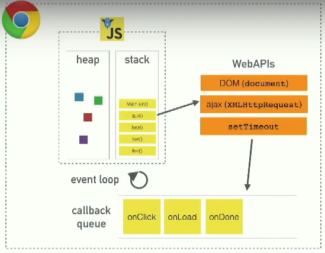

# Part 2 - (c) Getting data from server

This section uses a software development tool called [JSON Server](https://github.com/typicode/json-server) to act as the backend server. Our data will be stored in a local `db.json` file in the root directory of the project. Going forward, all notes inputted to the front end will be saved in the server so that it "persists" in memory.

JSON server can be installed globally using the command:

```
npm install -g json-server
```

Or simply run from the root directory of the app using the `npx` command, if administrative privileges are not available:

```
npx json-server --port 3001 --watch db.json
```

Note that `json-server` defaults to port 3000, which is reserved for `create-react-app`, so we define a alternative port (port 3001) instead.

## The browser as a runtime environment

One way to fetch data from the server using JavaScript is `XMLHttpRequest`, which is a technique introduced in 1999 but is **no longer recommended**. `XMLHttpRequest` works by:

 - Creating a `xhttp` object to represent the HTTP request
 - Registering an event handler for when the state of the `xhttp` object changes

Instead, browsers today support the `fetch` method, which is based on the concept of `promises`. 

JavaScript engines, or runtime environments:

 - follow the **synchronous model**, meaning the event handler is called at a point in time in the future, not immediately
 - require all input-output operations to be executed as non-blocking, meaning code execution continues immediately after calling a function, without waiting for it to return
 - are single-threaded, meaning they cannot execute code in parallel
 - can cause the browser to get stuck if code execution takes up a lot of time.

Today's browsers allow parallelised code to be run using web workers, however the event loop of an individual browser is still single-threaded. 

### Detailed explanation of underlying concepts ([source](https://www.youtube.com/watch?v=8aGhZQkoFbQ))

- **the call stack**: JavaScript is a single-threaded runtime environment so there is a single call stack, which only runs one thing in the time. The call stack stores a series of functions. More specficially, is a data structure that records where in the program we are. If we step into a function, we push it onto the stack, and if we return from a function, we pop it off the top of the stack. 
- **blocking**: things in the call stack which are slow / take a long time to execute (e.g. network requests are slow). If JavaScript were synchronous, we would have to wait for each request to finish before continuing with execution. This is a problem because while waiting for the request to finish, the browser effectively freezes (it can't do anything else).
- **asynchronous callbacks**: the solution to blocking. Most commonly, uses the `setTimeout` function to allow rest of code to execute before running a function. The `setTimeout` function actually exists outside of the JS runtime environment - it is part of the WebAPIs provided by the browser. Other async requests work the same way (e.g. XHR WebAPI).
- **callback queue / task queue**: functions wrapped within `setTimeout` are pushed onto the task queue, which exists outside of the JS runtime environment. 
- **event loop**: the job of the event loop is to push the first item in the task queue onto the call stack whenever the call stack is empty. This way, once all of the code has been executed, the tasks pushed to the task queue by `setTimeout` will be executed. In effect these items are pushed to the end of the call stack. 

Lesson of all this is not to put slow code on the call stack because it prevents the browser of doing its proper job, i.e. providing a smooth, fluid UI.



## npm

`npm` is the node package manager, which is used for adding external libraries (npm packages) to React projects. 

Packages are installed by running the following command at the root directory of the project.

```
npm install [package]
```

What this command does is:

 1. Download the library code to the `node_modules` directory
 2. Add the package to the `dependencies` object in `packages.json` (also found in the root directory of the project)

We can also use the `scripts` object in `packages.json` to do things like run the server without parameter definitions. 

**packages.json**
```javascript
{
  // ... 
  "scripts": {
    "start": "react-scripts start",
    "build": "react-scripts build",
    "test": "react-scripts test",
    "eject": "react-scripts eject",
    "server": "json-server -p3001 --watch db.json"
  },
}
```

**command line**
```
npm run server
```


